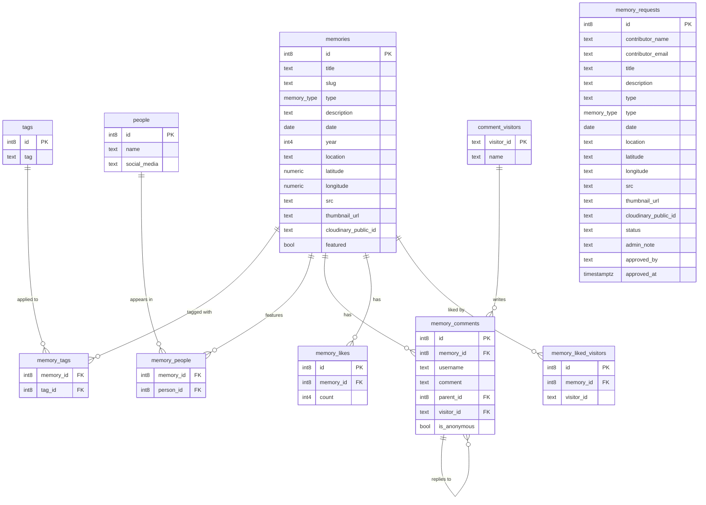

<div align="center">

# 🗂️ Pasha Archive

**A personal digital scrapbook for preserving moments, stories, and experiences — all in one place.**

</div>

---

## 🖼️ Preview

| Home Page | Galleries Page |
|---|---|
|  |  |

| Galleries Modal | Galleries Comment Page |
|---|---|
|  |  |

| Submission Memories Page | Login Page |
|---|---|
|  |  |

| Login Page | Dashboard Page |
|---|---|
|  |  |

| Add Memories | Edit Memories |
|---|---|
|  |  |

> 🔗 You can also try the live version here: **[www.mdpashaaa.web.id](https://www.mdpashaaa.web.id)**

---

## 🌟 About The Project

**Pasha Archive** is a personal gallery website built to document meaningful moments — photos, videos, locations, and the stories behind them — in one organized, browsable place.

The goal is simple: **capture moments, tell stories, and keep memories alive.**

---

## ✨ Features

### 🖼️ Gallery Collection
- Browse memories through a clean, responsive gallery layout
- Supports both photos and videos
- Detailed memory pages with descriptions and metadata
- Featured memories showcase on the homepage

### 🗺️ Memories Map
- Explore memories through an interactive, Leaflet-powered map
- Zoom-based clustering — zoomed out shows city clusters, zoomed in shows individual memories
- Click a pin to jump straight to that memory

### ❤️ Community Interaction
- Like memorable moments
- Leave comments on memories, with threaded replies
- Real-time updates powered by Supabase

### 🔍 Discover Memories
- Instant search across memories
- Filter by **type**, **year**, **location**, **tags**, and **people**

### 📤 Memory Submission System
- Visitors can submit a new memory for review, including:
  - Photos or videos
  - A story/description
  - Date and location information

### ⚙️ Admin Dashboard
- Review, approve, or reject submitted memories
- Content management system for the archive
- Cloudinary media integration

### 📱 Modern Experience
- Fully responsive, mobile-first design
- Smooth page transitions and micro-animations
- Fast page loads via Astro's island architecture
- SEO-optimized pages
- Neo-Brutalist interface

---

## 🛠 Tech Stack

| Layer | Technology |
|---|---|
| **Framework** | [Astro](https://astro.build) (with [React](https://react.dev) islands) |
| **Styling** | [Tailwind CSS](https://tailwindcss.com) |
| **Animation** | [Motion](https://motion.dev) |
| **Maps** | [Leaflet](https://leafletjs.com) + [react-leaflet](https://react-leaflet.js.org) + marker clustering |
| **Database & Backend** | [Supabase](https://supabase.com) — PostgreSQL, Realtime, Row Level Security (RLS) |
| **Media Storage** | [Cloudinary](https://cloudinary.com) |

---

## 📁 Project Structure

```
pasha-archive-web/
├── public/                    # Static assets (favicon, etc.)
├── src/
│   ├── assets/                 # Images, fonts, and other bundled assets
│   ├── components/
│   │   ├── Admin/               # Admin dashboard components
│   │   ├── Comments/            # Comment system (card, form, section, toast)
│   │   ├── Gallery/              # Gallery grid & memory card components
│   │   ├── Hero.astro
│   │   ├── MemoriesMap.jsx       # Interactive Leaflet map
│   │   ├── Navbar.astro
│   │   ├── Footer.astro
│   │   ├── RecentArchive.astro
│   │   ├── SubmitMemoryForm.jsx  # Submit Memory System for Public
│   │   └── SubmitPageCTA.astro
│   ├── layouts/
│   │   └── Layout.astro         # Base page layout
│   ├── lib/
│   │   ├── cloudinary.js        # Cloudinary upload/config helpers
│   │   └── supabase.ts          # Supabase client
│   ├── pages/
│   │   ├── admin/                # Admin dashboard page
│   │   ├── api/                  # Server endpoints (Cloudinary, memory requests)
│   │   ├── galleries/            # Gallery list + dynamic memory detail page
│   │   ├── index.astro           # Homepage
│   │   └── submit-memory.astro   # Public memory submission page
│   └── styles/                 # Global styles
├── astro.config.mjs
├── package.json
└── tsconfig.json
```

---

## 🗃️ Database Schema

The app is backed by a relational schema in Supabase. Memories are the core entity, with **tags** and **people** linked through junction tables — this avoids duplicating data and keeps the people/tag registries reusable across memories.



> ℹ️ `memory_requests` is a standalone submissions table — pending memories live here until an admin approves them and they're promoted into `memories`.

---

## 🚀 Getting Started

### Prerequisites

- A [Supabase](https://supabase.com) project
- A [Cloudinary](https://cloudinary.com) account

### 1. Clone the repository

```bash
git clone https://github.com/mdwipasha/pasha-archive-web.git
cd pasha-archive-web
```

### 2. Install dependencies

```bash
npm install
```

### 3. Configure environment variables

Create a `.env` file in the project root:

```env
# Supabase
PUBLIC_SUPABASE_URL=your_supabase_url
PUBLIC_SUPABASE_ANON_KEY=your_supabase_anon_key
SUPABASE_SERVICE_ROLE_KEY=your_supabase_service_role_key

# Cloudinary (Public)
PUBLIC_CLOUDINARY_CLOUD_NAME=your_cloud_name
PUBLIC_CLOUDINARY_UPLOAD_PRESET=your_upload_preset

# Cloudinary (Server)
CLOUDINARY_CLOUD_NAME=your_cloud_name
CLOUDINARY_API_KEY=your_api_key
CLOUDINARY_API_SECRET=your_api_secret
```

### 4. Run the development server

```bash
npm run dev
```

The app will be available at:

```
http://localhost:4321
```

## Troubleshooting

Possible causes:

- No admin user has been created in Supabase Authentication.
- Row Level Security (RLS) policies are missing or incorrectly configured.
- Supabase & Cloudinary API keys are invalid.

---

## 🗺️ Roadmap

- [ ] Memory timeline view
- [ ] Export archive as a downloadable PDF/scrapbook

> Have an idea? Feel free to [open an issue](https://github.com/mdwipasha/pasha-archive-web/issues).

---

## Created By

**Pasha [(Capa)](https://instagram.com/mdpashaaa)**

<div align="center">

*Built as a personal project to preserve moments, tell stories, and create a digital archive that can be revisited for years to come.*

</div>
